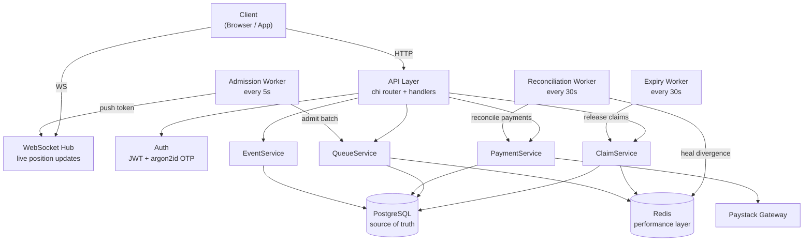
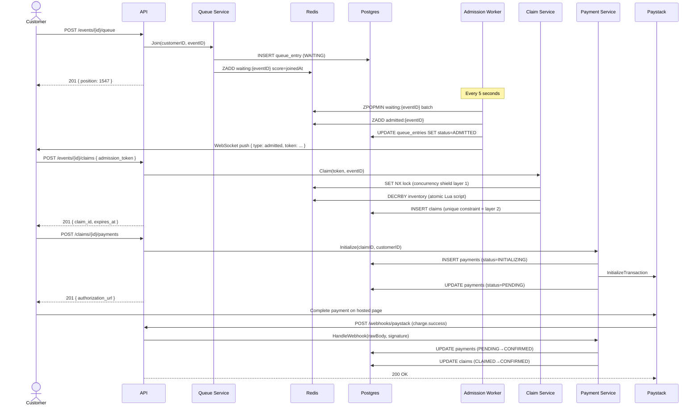
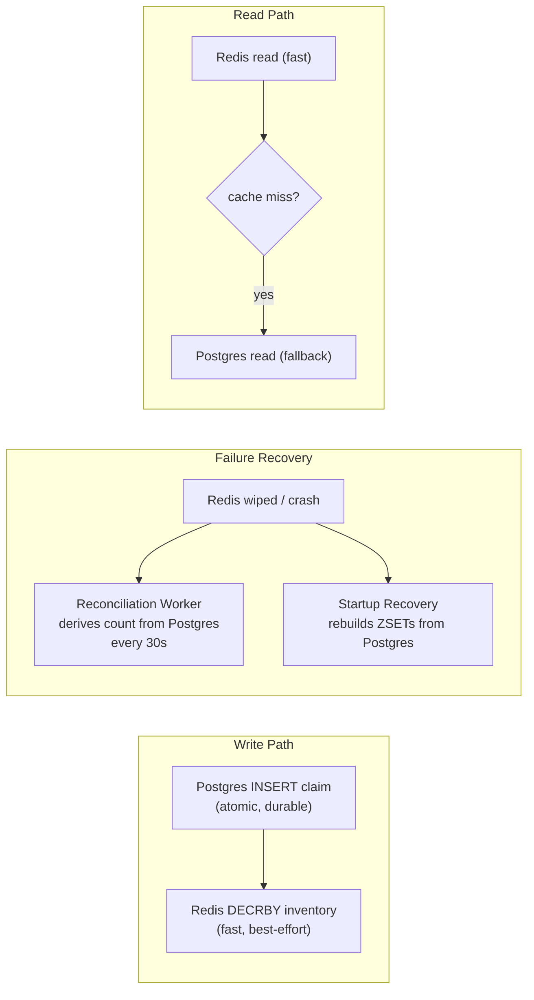
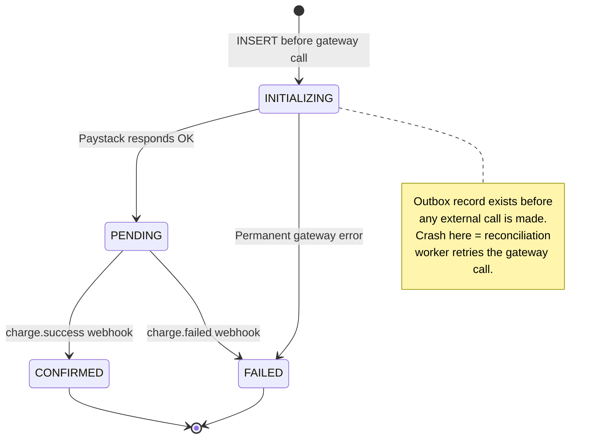
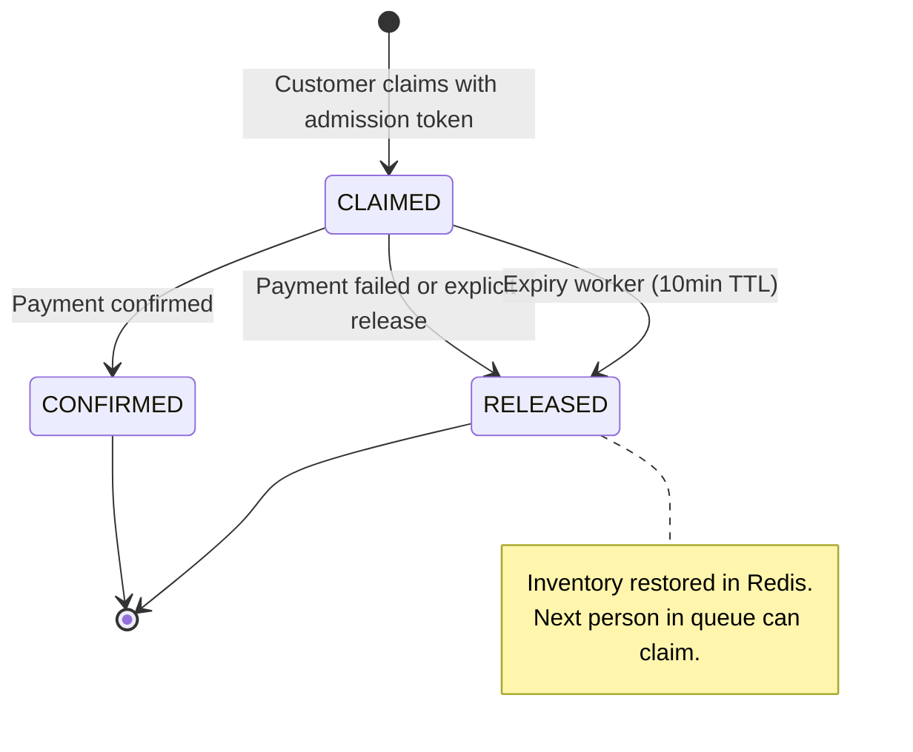
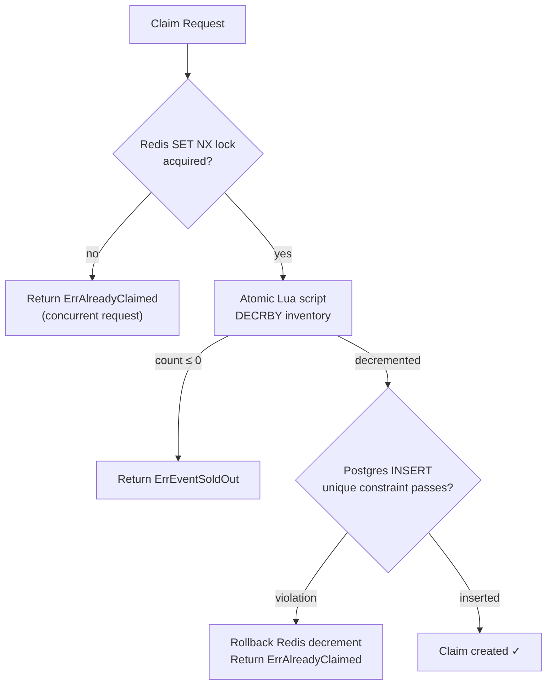

# Architecture

## Component Overview



## Request Flow: Customer Buys a Ticket



## Inventory Consistency Model

Redis is a performance layer over Postgres. It is never the source of truth.



## Payment State Machine



## Claim State Machine



## Concurrency Shield

Two independent layers prevent double-booking. Both must fail for an oversell to occur.



## Layer Dependencies

Each layer depends only on the layers below it. No upward dependencies.

```
┌─────────────────────────────────┐
│  API (handlers, middleware)     │  ← HTTP boundary
├─────────────────────────────────┤
│  Workers (scheduler, 3 workers) │  ← background processing
├─────────────────────────────────┤
│  Services (4 services)          │  ← business logic
├─────────────────────────────────┤
│  Stores (postgres, redis)       │  ← infrastructure
├─────────────────────────────────┤
│  Domain (state machines)        │  ← pure business rules
└─────────────────────────────────┘
```