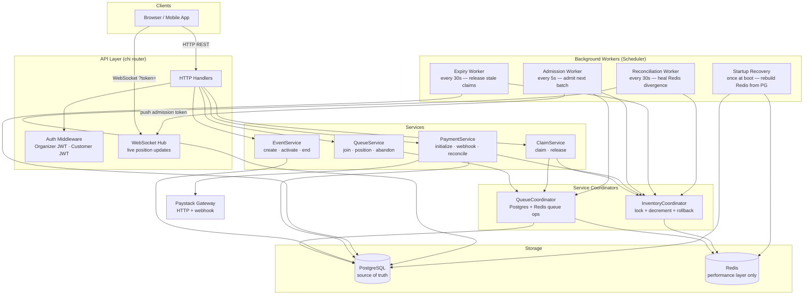

# Architecture

## System Overview

FairQueue is built in three horizontal layers. Each layer depends only on the layers below it. No upward dependencies exist.

```
┌─────────────────────────────────────────────────────┐
│  API Layer  (HTTP handlers, WebSocket hub)          │
├─────────────────────────────────────────────────────┤
│  Workers  (admission, expiry, reconciliation)       │
├─────────────────────────────────────────────────────┤
│  Services  (claims, queue, payments, events)        │
├─────────────────────────────────────────────────────┤
│  Stores  (postgres/, redis/)                        │
├─────────────────────────────────────────────────────┤
│  Domain  (state machines, pure business rules)      │
└─────────────────────────────────────────────────────┘
```

## Component Diagram



## Core Flows

### A customer buys a ticket

1. **Join queue** — `POST /events/{id}/queue` writes to Postgres and adds the customer to the Redis waiting ZSET with their join timestamp as score. This is an O(log N) Redis write — it absorbs any volume.

2. **Get admitted** — The admission worker runs every 5 seconds. It atomically moves the next batch from the waiting ZSET to the admitted ZSET (`ZPOPMIN` + `ZADD` in a Lua script), updates Postgres, generates a signed admission token per customer, and pushes it via WebSocket. Customers who miss the push poll `GET /events/{id}/queue/position` to retrieve their token.

3. **Claim** — `POST /events/{id}/claims` verifies the admission token, then runs through two concurrency layers: a Redis `SET NX` lock (layer 1) and an atomic Lua script that decrements the inventory counter only if it is above zero. If both pass, a claim row is inserted in Postgres. A unique constraint on `(event_id, customer_id)` is the final correctness guarantee.

4. **Pay** — `POST /claims/{id}/payments` writes a `Payment` row in `INITIALIZING` state before touching Paystack (the outbox pattern). It then calls the Paystack initialize API. On success the row moves to `PENDING`. When Paystack fires a `charge.success` webhook, both the payment and the claim are confirmed in a single Postgres transaction.

### What happens when Redis is wiped

Redis holds only reconstructible state. On startup, `RecoverRedisState` reads all active events from Postgres, derives the authoritative inventory count (`total_inventory - active_claims`), and re-adds it to Redis with `SET NX` (no-op if the key already exists). It also re-adds all `WAITING` queue entries to the ZSET using their original `joined_at` timestamp, preserving FIFO order exactly. Within 30 seconds, the reconciliation worker will also force-sync any remaining divergence.

## Inventory Consistency

Redis is a write-through cache over Postgres. The ordering is always: Postgres first, Redis second.

```
Claim request arrives
       │
       ▼
Redis SET NX lock acquired?
  No  → return ErrAlreadyClaimed
  Yes → continue
       │
       ▼
Redis Lua: DECRBY inventory if > 0
  -2 (sold out)  → return ErrEventSoldOut
  -1 (cache miss) → fall back to Postgres count, then retry
  ≥ 0 (success)  → continue
       │
       ▼
Postgres INSERT claim
  unique violation → rollback Redis decrement, return ErrAlreadyClaimed
  success          → claim created ✓
       │
       ▼
Release lock
```

If the server crashes after the Postgres commit but before the Redis decrement, Redis shows more inventory than actually exists. The reconciliation worker heals this within 30 seconds. The reverse — Redis showing less inventory than exists — would incorrectly turn away valid customers and is never permitted to happen.

## Payment State Machine

```
INITIALIZING  →  PENDING  →  CONFIRMED
     │               │
     └── FAILED ←────┘
```

A record is always written in `INITIALIZING` before the gateway is called. A crash at any point leaves a recoverable record. The reconciliation worker finds any record older than the configured stale threshold and either retries the initialization (for `INITIALIZING`) or polls Paystack for the current status (for `PENDING`).

## Claim State Machine

```
CLAIMED  →  CONFIRMED   (payment confirmed)
   │
   └──→  RELEASED       (payment failed, explicit release, or expiry worker)
```

When a claim moves to `RELEASED`, the Redis inventory counter is incremented and the next customer in the queue can claim. Postgres is always written first; the Redis increment is best-effort and healed by the reconciliation worker if it fails.