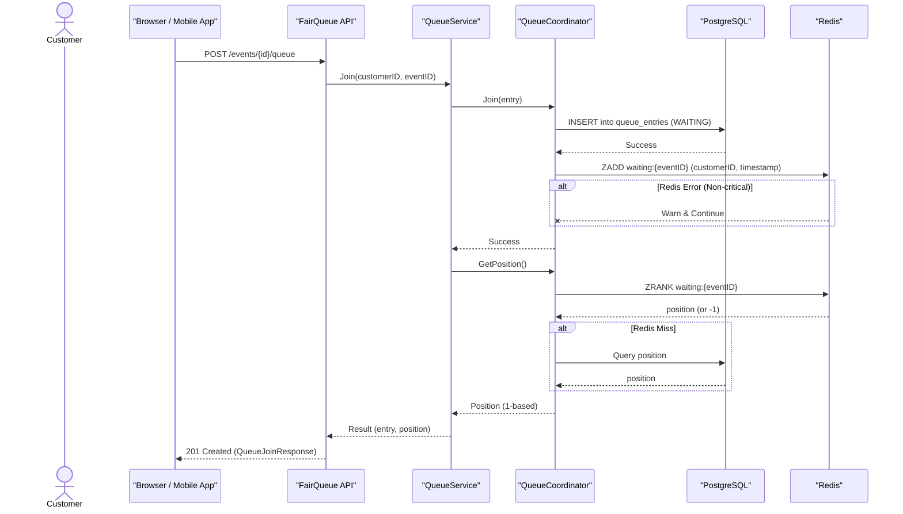
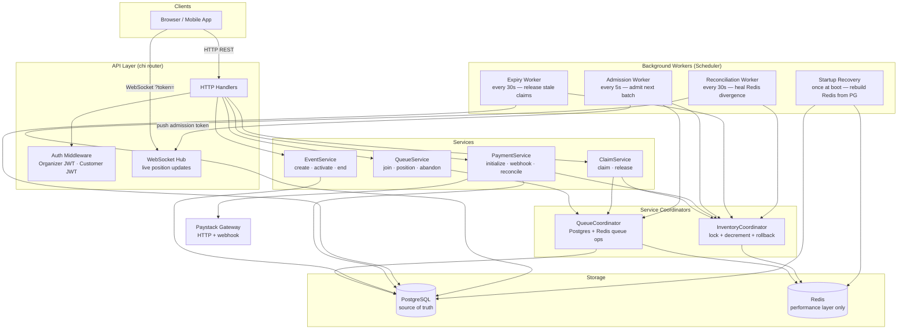

# FairQueue

FairQueue is a robust virtual queue and inventory allocation system designed for high-demand live events in Nigeria. It's engineered to gracefully handle massive traffic spikes—like when 50,000 people try to buy 5,000 tickets at the same instant—ensuring no overselling, preventing system crashes, and effectively deterring bot abuse.

## Overview

This project tackles the chaos that often comes with popular online ticket sales. It gives you a reliable way to manage a huge influx of users, put them in a fair queue, and then let them claim and pay for tickets without the system buckling under pressure or accidentally selling the same ticket twice. It's built for stability and correctness, even when things get crazy.

## Quick Start

Setting up FairQueue locally is straightforward using Docker Compose:

1.  **Clone the Repository**
    ```bash
    git clone https://github.com/DanielPopoola/fairqueue.git
    cd fairqueue
    ```
2.  **Configure Environment Variables**
    Copy the example environment file and fill in your Paystack API keys. Other settings work out of the box.
    ```bash
    cp .env.example .env
    # Open .env and replace PAYSTACK__SECRET_KEY and PAYSTACK__WEBHOOK_SECRET
    ```
3.  **Build and Run with Docker Compose**
    ```bash
    docker compose up --build
    ```

Once the services are up, the API will be available at `http://localhost:8080`, and the Swagger UI for API exploration will be at `http://localhost:8080/swagger/index.html`.

## Features

FairQueue manages the entire customer journey from joining a queue to confirming a payment, focusing on performance, fairness, and data consistency.

### 1. Virtual Queue Management

When an event goes on sale, customers join a waiting queue. FairQueue uses a Redis Sorted Set for fast, scalable queue operations and Postgres for durable queue entry records. A background worker then admits customers from this queue at a controlled rate, issuing them unique admission tokens.



### 2. Atomic Inventory Allocation (Claiming Tickets)

Once admitted, customers use a short-lived token to claim a ticket. This process uses a two-layer concurrency shield: a Redis `SET NX` lock for an initial, cheap check and an atomic Redis Lua script to decrement inventory. The final guarantee of correctness is a unique constraint in PostgreSQL, ensuring no overselling.

```mermaid
flowchart TD
  A[Customer sends POST /events/{id}/claims] --> B{Verify Admission Token & Ownership}
  B -- Invalid / Expired --> E_AUTH[Error: 400 ADMISSION_TOKEN_EXPIRED]
  B -- Valid & Owned --> C{Customer already has active claim?}
  C -- Yes --> E_ALREADY_CLAIMED[Error: 409 ALREADY_CLAIMED]
  C -- No --> D{Acquire Redis lock for customer:event?}
  D -- Lock already held --> E_LOCK_HELD[Error: 409 ALREADY_CLAIMED]
  D -- Lock Acquired --> E[Call InventoryCoordinator.AttemptDecrement]
  E --> F{Redis DECRBY inventory if > 0}
  F -- Result -2 (Sold Out) --> G[Release Redis Lock]
  G --> E_SOLD_OUT[Error: 410 EVENT_SOLD_OUT]
  F -- Result -1 (Cache Miss) --> H{Fallback: Count active claims from Postgres}
  H --> I{If Postgres Count <= 0}
  I -- Yes --> J[Release Redis Lock]
  J --> E_SOLD_OUT
  I -- No --> K[Force-sync Redis inventory with Postgres]
  K --> L[Retry Redis DECRBY]
  L --> F_CONT[Continue to F]
  F -- Result >= 0 (Success) --> M[Insert Claim into Postgres]
  M -- Unique Constraint Violation --> N[Rollback Redis Decrement]
  N --> P[Release Redis Lock]
  P --> E_ALREADY_CLAIMED_PG[Error: 409 ALREADY_CLAIMED]
  M -- Success --> Q[Mark Customer Queue Entry COMPLETED]
  Q --> R[Release Redis Lock]
  R --> S{Is new Redis inventory count <= 0?}
  S -- Yes --> T[Mark Event SOLD_OUT in Postgres]
  S -- No --> U[Return 201 Created]
  T --> U
```

### 3. Resilient Payment Processing (Outbox Pattern)

The payment flow implements an "outbox pattern" to ensure data consistency even in the face of system failures. A payment record is first created in a `INITIALIZING` state in PostgreSQL before any external payment gateway (e.g., Paystack) is called. This guarantees that no payment is lost or unrecorded. A reconciliation worker constantly monitors for stale payments and heals them.

```mermaid
sequenceDiagram
  actor Customer
  participant Browser as "Browser / Mobile App"
  participant API as "FairQueue API"
  participant PaymentSvc as "PaymentService"
  participant PaymentStore as "Postgres PaymentStore"
  participant Paystack as "Paystack Gateway"
  participant ClaimStore as "Postgres ClaimStore"
  participant Inventory as "InventoryCoordinator"

  Customer->>Browser: Click Pay
  Browser->>API: POST /claims/{id}/payments
  API->>PaymentSvc: Initialize(claimID, customerID)

  PaymentSvc->>PaymentStore: GetByClaimID(claimID)
  alt Existing Payment Found
    PaymentStore-->>PaymentSvc: Existing Payment
    PaymentSvc-->>API: 201 (Existing Auth URL)
    API-->>Browser:
    return
  end

  PaymentSvc->>PaymentStore: CREATE Payment (INITIALIZING)
  PaymentStore-->>PaymentSvc: Payment Record (ID)
  PaymentSvc->>Paystack: InitializeTransaction(customerEmail, amount, ref)
  alt Transient Paystack Error (e.g., Timeout)
    Paystack--XPaymentSvc: Error (transient)
    PaymentSvc--XAPI: Error (transient)
    API--XBrowser: 400 Bad Request
    note right of Paystack: Payment remains INITIALIZING in DB, Worker will retry
    return
  end
  alt Permanent Paystack Error (e.g., Invalid Card)
    Paystack--XPaymentSvc: Error (permanent)
    PaymentSvc->>PaymentStore: Mark Payment FAILED
    PaymentStore-->>PaymentSvc: Success
    PaymentSvc->>ClaimStore: Update Claim (RELEASED)
    ClaimStore-->>PaymentSvc: Success
    PaymentSvc->>Inventory: Increment(eventID)
    Inventory-->>PaymentSvc: Success (best effort)
    PaymentSvc--XAPI: Error (permanent)
    API--XBrowser: 400 Bad Request
    return
  end
  Paystack-->>PaymentSvc: Success (Auth URL, Reference)
  PaymentSvc->>PaymentStore: Mark Payment PENDING (with Auth URL)
  PaymentStore-->>PaymentSvc: Success
  PaymentSvc-->>API: 201 (Payment ID, Auth URL)
  API-->>Browser:
  Browser->>Customer: Redirect to Auth URL for payment
  activate Paystack
  Paystack->>Paystack: Customer completes payment
  deactivate Paystack
  Paystack->>API: POST /webhooks/paystack (charge.success/failed)
  API->>PaymentSvc: HandleWebhook(payload, signature)
  PaymentSvc->>PaymentSvc: (Async) processWebhook
  activate PaymentSvc
  PaymentSvc->>PaymentStore: GetByReference(reference)
  PaymentStore-->>PaymentSvc: Payment Record
  alt charge.success
    PaymentSvc->>PaymentStore: Update Payment (CONFIRMED)
    PaymentStore-->>PaymentSvc: Success (idempotent)
    PaymentSvc->>ClaimStore: Update Claim (CONFIRMED)
    ClaimStore-->>PaymentSvc: Success (idempotent)
  else charge.failed
    PaymentSvc->>PaymentStore: Mark Payment FAILED
    PaymentStore-->>PaymentSvc: Success (idempotent)
    PaymentSvc->>ClaimStore: Update Claim (RELEASED)
    ClaimStore-->>PaymentSvc: Success (idempotent)
    PaymentSvc->>Inventory: Increment(eventID)
    Inventory-->>PaymentSvc: Success (best effort)
  end
  deactivate PaymentSvc
  API-->>Paystack: 200 OK
```

### 4. Background Workers & Recovery

FairQueue includes several background workers for critical operations:

*   **Admission Worker**: Periodically moves customers from the waiting queue to the admitted queue.
*   **Expiry Worker**: Releases claims that expire without payment and purges stale queue entries.
*   **Reconciliation Worker**: Ensures consistency between Redis and PostgreSQL, correcting any divergences in inventory counts and payment statuses.
*   **Startup Recovery**: Rebuilds Redis state from PostgreSQL on application startup, ensuring a quick and accurate recovery after a Redis wipe or service restart.

For a deep dive into the design rationale and trade-offs behind these decisions, check out [TRADEOFFS.md](TRADEOFFS.md).

## System Architecture / Design

FairQueue follows a layered architecture, with clear separation of concerns between domain, storage, services, workers, and API layers. PostgreSQL is the single source of truth for all authoritative state, while Redis serves as a high-performance, reconstructible cache and queuing layer.



## Technologies Used

| Layer / Aspect      | Technology       | Description                                                 |
| :------------------ | :--------------- | :---------------------------------------------------------- |
| **Language**        | Go               | Primary programming language for performance and concurrency. |
| **Database**        | PostgreSQL 16    | Relational database, serving as the single source of truth. |
| **Cache / Queue**   | Redis 7          | In-memory data store for high-speed caching and virtual queuing. |
| **Payment Gateway** | Paystack         | External payment processing integration.                   |
| **HTTP Router**     | Chi              | Lightweight, idiomatic HTTP router for Go.                   |
| **WebSockets**      | coder/websocket  | Library for real-time bidirectional communication.         |
| **Containerization**| Docker, Compose  | For local development, testing, and deployment.            |
| **Metrics**         | Prometheus       | For collecting and exposing application metrics.             |
| **API Docs**        | Swaggo           | Auto-generates Swagger/OpenAPI documentation.              |
| **Testing**         | Testcontainers   | Spawning real database/cache instances for integration tests. |
| **Auth**            | Argon2id, JWT    | Secure password hashing and token-based authentication.    |
| **Logging**         | `log/slog`       | Structured logging for observability.                      |
| **Configuration**   | Koanf            | Flexible configuration management.                         |

## API Documentation

FairQueue exposes a RESTful API for organizers to manage events and for customers to join queues, claim tickets, and make payments. WebSocket endpoints provide real-time updates for queue positions.

**Base URL**: `http://localhost:8080`

### Authentication

*   **OrganizerAuth**: JWT issued on organizer login. Pass as `Authorization: Bearer {token}` header.
*   **CustomerAuth**: JWT issued on OTP verification. Pass as `Authorization: Bearer {token}` header for HTTP requests, or as `?token=` query parameter for WebSocket connections.

### Health Check

#### GET /health
**Description**: Returns the current health status of the API and its dependencies (Postgres, Redis).

**Response**:
```json
{
  "status": "healthy",
  "postgres": "ok",
  "redis": "ok"
}
```

**Errors**:
- 503: Service Unavailable (if any dependency is down)

### Auth Endpoints

#### POST /auth/organizer/login
**Description**: Authenticates an organizer with email and password, returning a JWT.

**Request**:
```json
{
  "email": "organizer@example.com",
  "password": "supersecret"
}
```

**Response**:
```json
{
  "success": true,
  "token": "eyJhbGciOiJIUzI1NiIsInR5cCI6IkpXVCJ9...",
  "organizer_id": "a1b2c3d4-e5f6-7890-1234-567890abcdef"
}
```

**Errors**:
- 401: UNAUTHORIZED / INVALID_CREDENTIALS (email or password incorrect)
- 400: INVALID_INPUT (invalid request body)

#### POST /auth/customer/otp/request
**Description**: Sends a 6-digit One-Time Password (OTP) to the customer's email. Creates a customer account if one doesn't exist. (Note: OTP is currently logged to console in development, not actually emailed.)

**Request**:
```json
{
  "email": "customer@example.com"
}
```

**Response**:
```json
{
  "success": true,
  "message": "OTP sent to your email"
}
```

**Errors**:
- 400: INVALID_INPUT (invalid email format)

#### POST /auth/customer/otp/verify
**Description**: Validates the provided OTP for a customer's email, returning a customer JWT upon success.

**Request**:
```json
{
  "email": "customer@example.com",
  "otp": "482910"
}
```

**Response**:
```json
{
  "success": true,
  "token": "eyJhbGciOiJIUzI1NiIsInR5cCI6IkpXVCJ9...",
  "customer_id": "a1b2c3d4-e5f6-7890-1234-567890abcdef"
}
```

**Errors**:
- 401: UNAUTHORIZED / INVALID_OTP (OTP is invalid or expired)
- 400: INVALID_INPUT (invalid request body)

### Event Endpoints

#### POST /events
**Description**: Creates a new event in `DRAFT` status. Requires `OrganizerAuth`.

**Authentication**: `OrganizerAuth`

**Request**:
```json
{
  "name": "Burna Boy Live in Lagos",
  "total_inventory": 5000,
  "price": 25000,
  "sale_start": "2024-08-01T10:00:00Z",
  "sale_end": "2024-08-01T22:00:00Z"
}
```

**Response**:
```json
{
  "success": true,
  "data": {
    "id": "e1a2b3c4-d5e6-7890-1234-567890abcdef",
    "organizer_id": "o1a2b3c4-d5e6-7890-1234-567890abcdef",
    "name": "Burna Boy Live in Lagos",
    "total_inventory": 5000,
    "price": 25000,
    "status": "DRAFT",
    "sale_start": "2024-08-01T10:00:00Z",
    "sale_end": "2024-08-01T22:00:00Z",
    "created_at": "2024-07-28T14:30:00Z",
    "updated_at": "2024-07-28T14:30:00Z"
  }
}
```

**Errors**:
- 401: UNAUTHORIZED
- 400: INVALID_INPUT (invalid event details, e.g., zero inventory, invalid dates)

#### GET /events/{eventId}
**Description**: Retrieves details for a specific event by its ID. Publicly accessible.

**Response**:
```json
{
  "success": true,
  "data": {
    "id": "e1a2b3c4-d5e6-7890-1234-567890abcdef",
    "organizer_id": "o1a2b3c4-d5e6-7890-1234-567890abcdef",
    "name": "Burna Boy Live in Lagos",
    "total_inventory": 5000,
    "price": 25000,
    "status": "DRAFT",
    "sale_start": "2024-08-01T10:00:00Z",
    "sale_end": "2024-08-01T22:00:00Z",
    "created_at": "2024-07-28T14:30:00Z",
    "updated_at": "2024-07-28T14:30:00Z"
  }
}
```

**Errors**:
- 404: NOT_FOUND (event not found)
- 400: INVALID_INPUT (invalid eventId format)

#### PUT /events/{eventId}/activate
**Description**: Transitions an event from `DRAFT` to `ACTIVE` status, making it available for queueing and claims. Requires `OrganizerAuth`.

**Authentication**: `OrganizerAuth`

**Response**: (Same as GET /events/{eventId} but with `status: "ACTIVE"`)

**Errors**:
- 401: UNAUTHORIZED
- 403: FORBIDDEN (organizer does not own this event)
- 404: NOT_FOUND (event not found)
- 400: INVALID_TRANSITION (event is not in `DRAFT` status)

#### PUT /events/{eventId}/end
**Description**: Transitions an event from `ACTIVE` or `SOLD_OUT` to `ENDED` status. Requires `OrganizerAuth`.

**Authentication**: `OrganizerAuth`

**Response**: (Same as GET /events/{eventId} but with `status: "ENDED"`)

**Errors**:
- 401: UNAUTHORIZED
- 403: FORBIDDEN (organizer does not own this event)
- 404: NOT_FOUND (event not found)
- 400: INVALID_TRANSITION (event is not in `ACTIVE` or `SOLD_OUT` status)

### Queue Endpoints

#### POST /events/{eventId}/queue
**Description**: Adds the authenticated customer to the waiting queue for an event. Requires `CustomerAuth`.

**Authentication**: `CustomerAuth`

**Response**:
```json
{
  "success": true,
  "queue_entry_id": "q1a2b3c4-d5e6-7890-1234-567890abcdef",
  "event_id": "e1a2b3c4-d5e6-7890-1234-567890abcdef",
  "position": 1547
}
```

**Errors**:
- 401: UNAUTHORIZED
- 404: NOT_FOUND (event not found or not active)
- 409: ALREADY_IN_QUEUE (customer is already in the queue)

#### GET /events/{eventId}/queue/position
**Description**: Returns the authenticated customer's current position in the queue. If the customer has been admitted, it returns position `0` and an `admission_token`. Requires `CustomerAuth`.

**Authentication**: `CustomerAuth`

**Response (Waiting)**:
```json
{
  "success": true,
  "position": 847,
  "status": "WAITING"
}
```

**Response (Admitted)**:
```json
{
  "success": true,
  "position": 0,
  "status": "ADMITTED",
  "admission_token": "eyJhbGciOiJIUzI1NiIsInR5cCI6IkpXVCJ9..."
}
```

**Errors**:
- 401: UNAUTHORIZED
- 404: NOT_FOUND (customer is not in the queue for this event)

#### DELETE /events/{eventId}/queue
**Description**: Removes the authenticated customer from the waiting queue. Only `WAITING` entries can be abandoned. Requires `CustomerAuth`.

**Authentication**: `CustomerAuth`

**Response**:
`204 No Content`

**Errors**:
- 401: UNAUTHORIZED
- 404: NOT_FOUND (queue entry not found)
- 400: INVALID_TRANSITION (admitted customers cannot abandon the queue)

### Claim Endpoints

#### POST /events/{eventId}/claims
**Description**: Allows an admitted customer to claim a ticket using their `admission_token`. The customer then has a limited time to complete payment. Requires `CustomerAuth`.

**Authentication**: `CustomerAuth`

**Request**:
```json
{
  "admission_token": "eyJhbGciOiJIUzI1NiIsInR5cCI6IkpXVCJ9..."
}
```

**Response**:
```json
{
  "success": true,
  "claim_id": "c1a2b3c4-d5e6-7890-1234-567890abcdef",
  "event_id": "e1a2b3c4-d5e6-7890-1234-567890abcdef",
  "expires_at": "2024-07-28T14:40:00Z"
}
```

**Errors**:
- 401: UNAUTHORIZED
- 400: INVALID_INPUT (invalid eventId or admission token)
- 409: ALREADY_CLAIMED (customer already has an active claim)
- 410: EVENT_SOLD_OUT (event is sold out)
- 400: ADMISSION_TOKEN_EXPIRED (token is expired or invalid for this event/customer)

#### DELETE /claims/{claimId}
**Description**: Explicitly releases an active claim before its TTL expires, returning the ticket to available inventory. Requires `CustomerAuth`.

**Authentication**: `CustomerAuth`

**Response**:
`204 No Content`

**Errors**:
- 401: UNAUTHORIZED
- 403: FORBIDDEN (customer does not own this claim)
- 404: NOT_FOUND (claim not found)
- 409: INVALID_TRANSITION (claim is not in a releaseable state)

### Payment Endpoints

#### POST /claims/{claimId}/payments
**Description**: Initializes a payment transaction for a given claim. This endpoint is idempotent and will return the existing payment details if called multiple times for the same claim. Requires `CustomerAuth`.

**Authentication**: `CustomerAuth`

**Response**:
```json
{
  "success": true,
  "payment_id": "p1a2b3c4-d5e6-7890-1234-567890abcdef",
  "authorization_url": "https://paystack.co/pay/someref123",
  "reference": "fq-uuid-reference"
}
```

**Errors**:
- 401: UNAUTHORIZED
- 403: FORBIDDEN (customer does not own this claim)
- 404: NOT_FOUND (claim not found)
- 400: INVALID_INPUT (e.g., claim expired or not in claimable state)

#### POST /webhooks/paystack
**Description**: Receives `charge.success` and `charge.failed` webhook events from Paystack to update payment and claim statuses. No explicit authentication header for this endpoint (HMAC signature in `x-paystack-signature` is verified internally).

**Request**:
```json
{
  "event": "charge.success",
  "data": {
    "reference": "fq-uuid-reference",
    "status": "success",
    "gateway_response": "Approved"
  }
}
```

**Response**:
`200 OK`

**Errors**:
- 400: INVALID_INPUT (invalid payload or signature)

### Real-time WebSockets

#### GET /ws/queue/{eventId}
**Description**: Establishes a WebSocket connection for real-time queue position updates and admission notifications. Authentication is via a `CustomerAuth` JWT passed as a query parameter.

**Authentication**: `CustomerAuth` (via `?token=` query parameter)

**Example messages from server**:
```json
{ "type": "position", "position": 847 }
{ "type": "admitted", "admission_token": "eyJhbGciOiJIUzI1NiIsInR5cCI6IkpXVCJ9..." }
```

**Errors**:
- 401: UNAUTHORIZED (invalid or missing JWT)

### Metrics

#### GET /metrics
**Description**: Exposes Prometheus-compatible metrics for monitoring the application's performance.

**Response**: (Prometheus text format)

### Environment Variables

The following environment variables are used to configure the application:

| Variable                     | Description                                            | Example Value                        |
| :--------------------------- | :----------------------------------------------------- | :----------------------------------- |
| `ENV`                        | Application environment (development, production)      | `development`                        |
| `SERVER__PORT`               | Port the HTTP server listens on                        | `8080`                               |
| `SERVER__READ_TIMEOUT`       | Server read timeout                                    | `15s`                                |
| `SERVER__WRITE_TIMEOUT`      | Server write timeout                                   | `15s`                                |
| `SERVER__IDLE_TIMEOUT`       | Server idle timeout                                    | `60s`                                |
| `DATABASE__HOST`             | PostgreSQL host                                        | `localhost`                          |
| `DATABASE__PORT`             | PostgreSQL port                                        | `5432`                               |
| `DATABASE__USER`             | PostgreSQL user                                        | `fairqueue`                          |
| `DATABASE__PASSWORD`         | PostgreSQL password                                    | `fairqueue`                          |
| `DATABASE__NAME`             | PostgreSQL database name                               | `fairqueue`                          |
| `DATABASE__SSL_MODE`         | PostgreSQL SSL mode                                    | `disable`                            |
| `DATABASE__MAX_OPEN_CONNS`   | Max open database connections                          | `25`                                 |
| `DATABASE__MAX_IDLE_CONNS`   | Max idle database connections                          | `5`                                  |
| `DATABASE__CONN_MAX_LIFETIME`| Max connection lifetime                                | `15m`                                |
| `DATABASE__CONN_MAX_IDLE_TIME`| Max connection idle time                              | `5m`                                 |
| `REDIS__HOST`                | Redis host                                             | `localhost`                          |
| `REDIS__PORT`                | Redis port                                             | `6379`                               |
| `REDIS__PASSWORD`            | Redis password (if any)                                | ` `                                  |
| `REDIS__DB`                  | Redis database index                                   | `0`                                  |
| `AUTH__TOKEN_SECRET`         | Secret key for JWTs (at least 32 chars)                | `replace-this-with-a-random-secret-at-least-32-chars` |
| `AUTH__TOKEN_TTL`            | TTL for customer admission tokens                      | `5m`                                 |
| `PAYSTACK__SECRET_KEY`       | Paystack secret key (`sk_test_...`)                    | `sk_test_xxxxxxxxxxxxxxxxxxxxxxxxxxxxxxxxxxxxxxxx` |
| `PAYSTACK__WEBHOOK_SECRET`   | Paystack webhook secret (for HMAC verification)        | `replace-with-your-paystack-webhook-secret` |
| `PAYSTACK__BASE_URL`         | Paystack API base URL                                  | `https://api.paystack.co`            |
| `GATEWAYRETRY__MAX_ATTEMPTS` | Max retry attempts for gateway calls                   | `3`                                  |
| `GATEWAYRETRY__BASE_DELAY`   | Base delay for exponential backoff                     | `500ms`                              |
| `GATEWAYRETRY__MAX_DELAY`    | Max delay for exponential backoff                      | `5s`                                 |
| `WORKERS__ADMISSION__INTERVAL`| Admission worker run interval                          | `5s`                                 |
| `WORKERS__ADMISSION__BATCH_SIZE`| Number of customers to admit per batch                | `50`                                 |
| `WORKERS__EXPIRY__INTERVAL`  | Expiry worker run interval                             | `30s`                                |
| `WORKERS__EXPIRY__BATCH_SIZE`| Batch size for expiring claims/queue entries           | `100`                                |
| `WORKERS__RECONCILIATION__INTERVAL`| Reconciliation worker run interval                   | `30s`                                |
| `WORKERS__RECONCILIATION__STALE_PAYMENT_AGE`| Age at which a payment is considered stale          | `10m`                                |
| `WORKERS__RECONCILIATION__STALE_QUEUE_ENTRY_AGE`| Age at which a queue entry is considered stale      | `2h`                                 |
| `LOGGER__LEVEL`              | Logging level (debug, info, warn, error)               | `info`                               |


## Running Tests

FairQueue uses a comprehensive testing strategy including unit, integration, and end-to-end tests.

```bash
# Domain logic only — fast, no infrastructure required
make test-unit

# Service and worker tests — spins up real Postgres and Redis via testcontainers
make test-integration

# Full end-to-end flow tests
make test-e2e

# Everything
make test
```

Integration tests leverage `testcontainers-go` to spin up actual PostgreSQL and Redis instances, ensuring that components interact correctly with real infrastructure rather than mocks. The only mock in the codebase is for the external Paystack payment gateway, which eliminates unreliable external HTTP calls from the test suite.

## License

This project is open-source.

## Author Info

**Daniel Popoola**
*   [LinkedIn](https://www.linkedin.com/in/daniel-popoola-942aa8216/)
*   [X (Twitter)](https://x.com/iamuchihadan)

[](https://www.npmjs.com/package/dokugen)